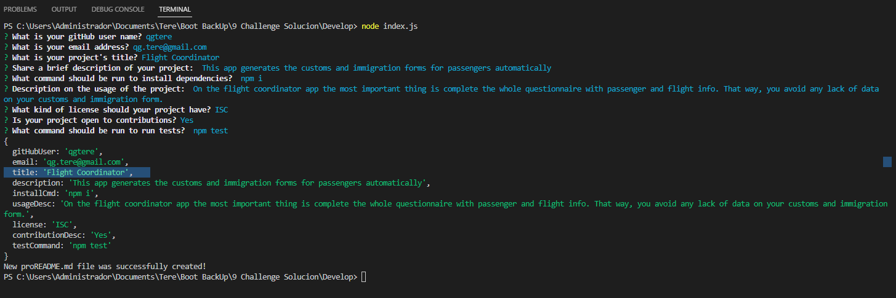

# Professional README Generator.

 This is a command-line application which will generate a high-quality README for your projects in a quickly way, allowing you to devote more time to working on the project itself.

 ## Application functionality.

 * On the command-line run
    ```bash
    node index.js
    ```

 * A few questions about your project will be prompted, answer them in the most accurate way.

 * You can select to add a License, welcome or not to contributions to your project, link your contact info for further questions, and more.

 * A new file named "proREADME.md" will be created.

 ## Video.

  [Link to the video](https://drive.google.com/file/d/17KPd-B0SgmW0Agitr6r8aVPeChDyQUDK/view)

  ## The work.

  * Use of npm commands

  * Incluide packages as Inquirer and fs (file system)

  * Create a gitignore file

  * Practice of arrow functions

  ## Techs.

  * Javascript

  * Node.js

  ## Mock Up

    